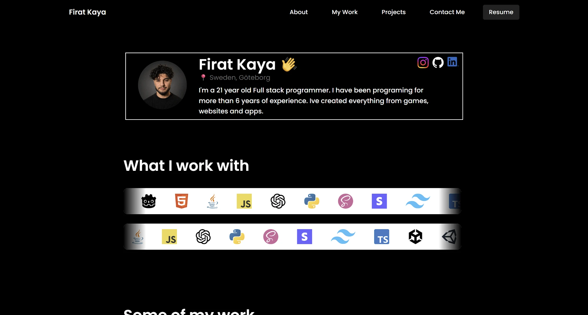

<div align="center">

# Firat Kaya — Portfolio

**A fast, responsive developer portfolio built with React, Vite and Tailwind CSS.**

[](https://react.dev)
[](https://vitejs.dev)
[](https://tailwindcss.com)
[](https://vercel.com)



</div>

---

## Overview

This is my personal portfolio, showcasing my background as a full-stack developer with experience across games, web and mobile/automotive apps. It presents my tech stack, selected projects with dedicated case-study pages, education and certificates, and ways to get in touch, along with a downloadable CV.


## Features

- **Hero & about section** with a short bio and links to GitHub, LinkedIn and Instagram.
- **Animated tech-stack marquee** with two counter-scrolling rows of technology logos.
- **Project showcases** with individual case-study pages and image carousels.
- **Education timeline** covering degrees and certificates (Cisco, etc.).
- **Downloadable résumé** available directly from the navigation bar.
- **Multi-page routing** with clean URLs, configured for Vercel.
- **Responsive, dark-themed UI** that works from mobile to desktop.

## Featured Projects

| Project | Description |
| --- | --- |
| **Volturiano Agent** | AI-driven agent product with a dedicated case-study page. |
| **Android Car Infotainment** | AI copilot infotainment concept for Android Automotive. |
| **Wacky Warriors** | 2.5D multiplayer-style fighting game with multiple characters, cross-input support and varied arenas. |
| **Brainrot Video Generator** | Automated short-form video tool using ChatGPT, ElevenLabs and MoviePy. |
| **Custom Steering Wheel Shop** | E-commerce site with Unity-powered product customization. |
| **Car Wash Tracker** | Web app for tracking car-wash operations. |
| **Exhuarire** | Side-scrolling game built in a team. |
| **Gates of Hell** | Game project with a dedicated showcase page. |

## Tech Stack

| Area | Technologies |
| --- | --- |
| Frontend | React 18, React Router 7, Vite 6 |
| Styling | Tailwind CSS 4, custom CSS, PostCSS / Autoprefixer |
| Icons | Lucide React, SVG assets |
| Tooling | ESLint 9, Git & GitHub |
| Hosting | Vercel |
| Design | Figma (the source file is included as `PortfolioWebsite2.fig`) |

## Getting Started

### Prerequisites

- [Node.js](https://nodejs.org) 18 or newer
- npm

### Installation

```bash
git clone https://github.com/Firathubgit/PortfolioWebsite2.git
cd PortfolioWebsite2/portfoliowebsite2/portfoliowebsite2tail
npm install
```

### Run locally

```bash
npm run dev
```

The site will be available at `http://localhost:5173`.

### Available scripts

| Command | Description |
| --- | --- |
| `npm run dev` | Start the Vite development server |
| `npm run build` | Create a production build in `dist/` |
| `npm run preview` | Preview the production build locally |
| `npm run lint` | Lint the codebase with ESLint |

## Project Structure

```text
PortfolioWebsite2/
├── docs/assets/                 # README images
├── PortfolioWebsite2.fig        # Figma design file
└── portfoliowebsite2/
    └── portfoliowebsite2tail/   # Application source
        ├── public/              # Static assets, project images, CV PDFs
        ├── projects/            # HTML entry points for project pages
        ├── src/
        │   ├── Components/      # Hero, Navbar, Projects, Education, Contact, ...
        │   │   └── ProjectPages/  # Per-project case-study pages
        │   ├── App.jsx          # Home page (tech-stack marquee, sections)
        │   └── main.jsx
        ├── vercel.json          # Clean-URL routing
        └── vite.config.js       # Multi-page build configuration
```

## Deployment

The site is deployed on [Vercel](https://vercel.com). Routes for the individual pages and project case studies are defined in `vercel.json`. To deploy your own copy, import the repository in Vercel and set the root directory to `portfoliowebsite2/portfoliowebsite2tail`. The build command is `npm run build` and the output directory is `dist`.

## Contact

- **LinkedIn:** [Firat Kaya](https://www.linkedin.com/in/firat-kaya-baba45267)
- **GitHub:** [@Firathubgit](https://github.com/Firathubgit)
- **Instagram:** [@Atal_Moretti](https://www.instagram.com/Atal_Moretti)
- **Email:** Firat05_@hotmail.com

---

<div align="center">

Designed and built by **Firat Kaya** · Gothenburg, Sweden

</div>
